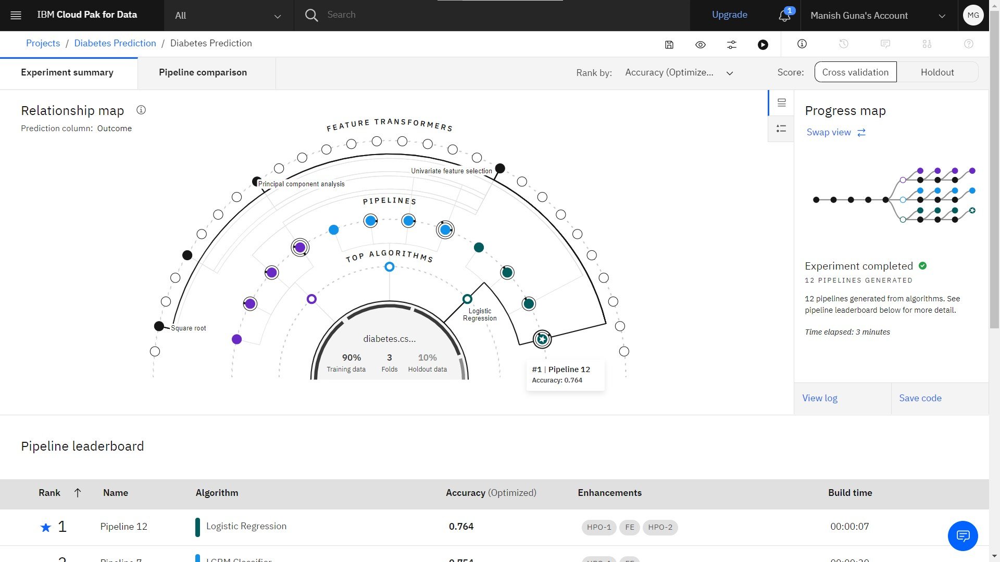
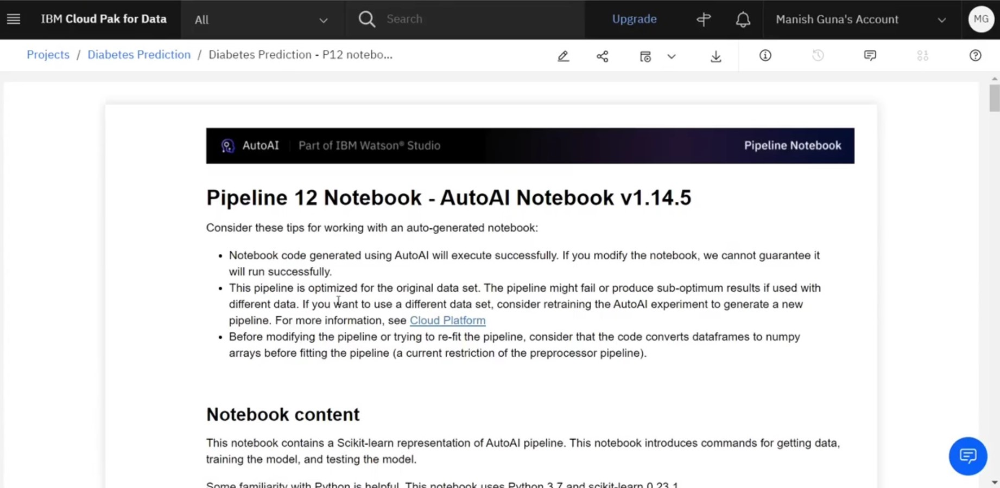
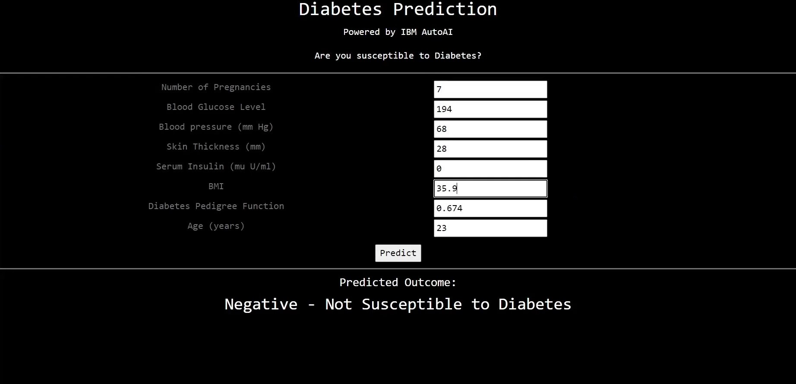

# IBM Watson AutoAI - Diabetes Prediction

This project contains the Notebook and sample web app to test the model generated by AutoAI.

Want to learn about AutoAI and how it works? [Visit this link](https://www.datawrangler.in/blog/16-ibm-autoai/) to read the blog article from datawrangler.in



## What does this project contain?

- Python Notebook generated automatically by AutoAI: [Click here](https://nbviewer.jupyter.org/github/datawrangl3r/autoai-diabetes-prediction/blob/master/notebook/DiabetesPredictionnotebook.ipynb) to have a look at the generated notebook.

[Refer to this video on how to create an AutoAI service and deploy the model to production.](https://www.youtube.com/watch?v=XLuh7AeSWCw)



- A Sample web app to utilize the deployed model as a web api for the prediction of the onset of Diabetes.

## How to deploy the web app



Make sure you have access to a target space with your model deployed and an IAM key generated for the model API to be invoked. 

* **Creating IAM Key and Deployment Key:** Refer to this video to create an **IAM Key**: https://youtu.be/XLuh7AeSWCw?t=1123 and **Deployment Key**: https://youtu.be/XLuh7AeSWCw 

* Clone the project directory as:

```bash
$ git clone https://github.com/datawrangl3r/autoai-diabetes-prediction.git
$ cd autoai-diabetes-prediction/webapp
```

* Initialize a virtual environment:

```bash
$ python3 -m venv .
$ source bin/activate
```

* Install the prerequisites:

```bash
$ pip install -r requirements.txt
```

* Edit the file `app.py` to include the IAM key created from the previous step. Replace the text `YOUR IAM KEY GOES HERE` with your generated IAM key. Also, replace the text `YOUR DEPLOYMENT ID GOES HERE` with the created deployment key.

* Finally, run the app using the command:

```bash
$ flask run
```

* Now that the app is running, fire up your browser and visit http://localhost:8000 to access the web application.

